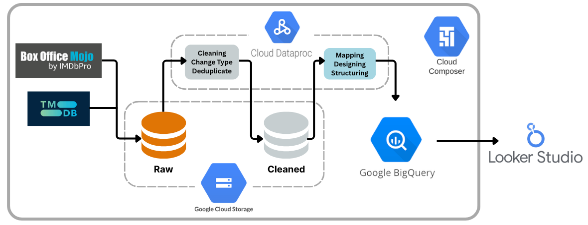
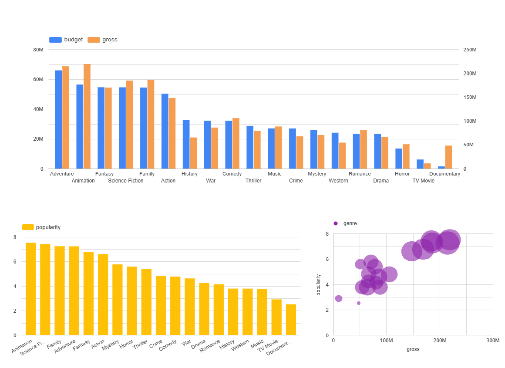

# Movie Data Engineering Pipeline: Unveiling Film Popularity and Box Office Success
This document provides a detailed explanation of a comprehensive data engineering pipeline designed to collect, process, and analyze movie data, including popularity, vote counts, and gross revenue. This project showcases a modern ETL (Extract, Transform, Load) architecture built entirely on Google Cloud Platform (GCP) technologies, making it scalable, robust, and efficient.

# Why This Project?
Driven by a passion for movies and an interest in understanding film success, this project allowed me to combine personal curiosity with data engineering aspirations, building a real-world data solution.

# Project Architecture and Tools

The project uses a robust ETL architecture with various GCP services for efficient data flow, processing, and analysis. The workflow is shown in the diagram below:

- **TMDB API**: Provides extensive movie information (popularity, votes, genres, release dates) and was chosen for its comprehensive, well-documented data essential for popularity and audience reception analysis.

- **Box Office Mojo (Web Scraping)**: A leading source for detailed box office revenue data, crucial for understanding commercial success, which necessitated web scraping to acquire.

- **Google Cloud Storage (GCS)**: A scalable and durable object storage service used for raw and cleaned data. It serves as the central data lake due to its cost-effectiveness, high availability, and seamless integration with other GCP services.

- **Dataproc**: A managed Apache Spark and Hadoop service handling data Cleaning, Change Type, Deduplicate, Mapping, Designing, and Structuring. It offers a powerful, scalable environment for efficient large-scale data transformation.

- **BigQuery**: A fully managed, serverless data warehouse for rapid SQL queries. It's the analytical cornerstone, chosen for its extreme query performance, scalability, and cost-effectiveness for large datasets, forming the basis for reporting.

- **Cloud Composer** (Apache Airflow): A managed workflow orchestration service that schedules, monitors, and manages the ETL pipeline. It ensures automated, reliable, and maintainable data processes through robust DAG capabilities.

- **Looker Studio**: A free, web-based data visualization tool connected to BigQuery. It enables intuitive creation of interactive dashboards and reports for sharing real-time insights.

# Data Modeling
The data is modeled using a denormalized approach within a single primary table, optimized for analytical queries in BigQuery. This design leverages BigQuery's nested and repeated field capabilities to store both static attributes and time-series metrics in one record.

- **movies**: The movie table is a denormalized, comprehensive table using BigQuery's REPEATED RECORD types. popularity, vote_average, vote_count, and gross fields store daily cumulative data (value and current_date) directly within each movie record. casts and crews are also REPEATED RECORD fields, linking to the credit dimension via person_id. production_companies links to the company dimension.

- **credits**: The credit dimension centralizes individual information, preventing redundancy and ensuring consistency. person_id links to the movie table's nested casts and crews fields.

- **companies**: The company dimension provides production entity details, enabling filtering and aggregation by company attributes. company_id links to the production_companies field in the movie table.
- **dim_date**: The date dimension table facilitates time-based analysis by providing various time attributes, improving query performance and simplifying reporting. It can be joined with movie.release_date and the current_date fields within movie's nested metrics

## Example Reports

This image displays three different graphs, likely from a dashboard in Looker Studio, providing insights into movie data based on genre.

- **Budget vs. Gross Revenue**: A bar chart comparing investment (budget) and earnings (gross) by genre, highlighting that genres like "Adventure" and "Animation" typically have high budgets and strong commercial returns.

- **Popularity by Genre**: A bar chart ranking genres by average popularity, showing "Animation" and "Science Fiction" as most popular.

- **Popularity vs. Gross Revenue**: A bubble chart illustrating the correlation between a genre's popularity and its gross revenue, generally indicating that higher popularity aligns with greater commercial success.

Collectively, these graphs offer insights into genre-specific financial performance and audience engagement in the film industry.